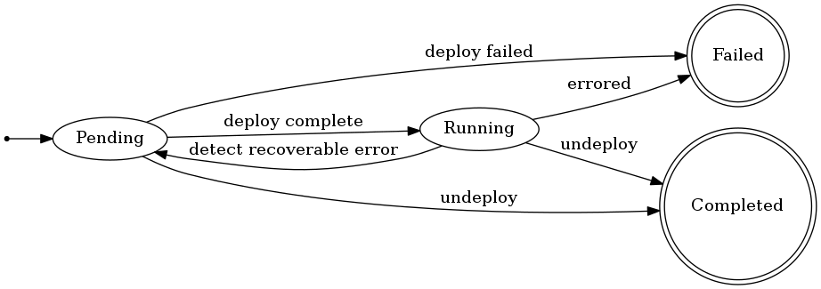

Model Training Controller
============================

## Job States

A Model Training job's state space consists of 4 states:

```go
const (
	Pending states.State = iota
	Running
	Completed
	Failed
)
```

* `Pending` - In this state, a job has been created, but its sub-resources are still in pending state.
* `Running` - This is the _ready_ state for a model training job. In this state, it is working as expected.
* `Completed` - A `Completed` job has been undeployed. `Completed` is a terminal state.
* `Failed` - A job is in an `Failed` state if an error has caused it to no longer be running as expected.


